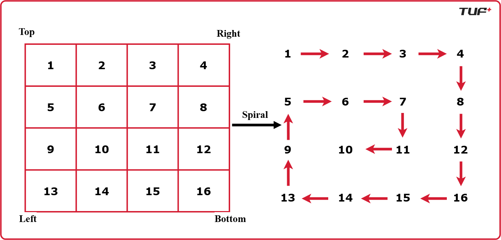

/*
Spiral Matrix Traversal
The goal is to traverse a 2D matrix of size M×N in a clockwise spiral pattern, starting from the top-left corner and moving inward.

Optimal Approach
We use four pointers (top, bottom, left, right) to represent the current boundaries of the matrix that have not yet been visited. By iterating through these boundaries and shrinking them after each side is processed, we ensure every element is visited exactly once.

Algorithm Steps
Initialize top to 0, bottom to n-1, left to 0, and right to m-1.

Use a while loop that continues as long as top <= bottom and left <= right.

Iterate from left to right along the top row, then increment top.

Iterate from top to bottom along the right column, then decrement right.

Check if top <= bottom to prevent redundant processing, then iterate from right to left along the bottom row and decrement bottom.

Check if left <= right to prevent redundant processing, then iterate from bottom to top along the left column and increment left.

Implementation
c
1->2->3->4->8->12->16->15->14->13->9->5->6->7->11->10

                Top {{1, 2, 3, 4}, Right
                      {5, 6, 7, 8}, 
                      {9, 10, 11, 12}, 
            Left      {13, 14, 15, 16}}; bottom

            
             https://static.takeuforward.org/premium/Arrays/FAQs%20Medium/Print%20the%20matrix%20in%20spiral%20manner/-BJpvOOmp
*/

#include <stdio.h>
#include <stdlib.h>
/**
 * Returns a pointer to an array containing elements in spiral order.
 * Note: Caller is responsible for freeing the returned memory.
 */
int* spiralOrder(int** matrix, int rows, int cols, int* returnSize) {
    *returnSize = rows * cols;
    int* ans = (int*)malloc((*returnSize) * sizeof(int));
    
    int top = 0, bottom = rows - 1;
    int left = 0, right = cols - 1;
    int index = 0;
    while (top <= bottom && left <= right) {
        // Traverse left to right
        for (int i = left; i <= right; i++) 
            ans[index++] = matrix[top][i];
        top++;
        // Traverse top to bottom
        for (int i = top; i <= bottom; i++) 
            ans[index++] = matrix[i][right];
        right--;
        // Traverse right to left
        if (top <= bottom) {
            for (int i = right; i >= left; i--) 
                ans[index++] = matrix[bottom][i];
            bottom--;
        }
        // Traverse bottom to top
        if (left <= right) {
            for (int i = bottom; i >= top; i--) 
                ans[index++] = matrix[i][left];
            left++;
        }
    }
    return ans;
}
int main() {
    int rows = 4, cols = 4;
    int data[4][4] = {{1, 2, 3, 4}, 
                      {5, 6, 7, 8}, 
                      {9, 10, 11, 12}, 
                      {13, 14, 15, 16}};
    
    // Pointer array to simulate 2D matrix in C
    int* matrix[4];
    for(int i = 0; i < 4; i++) 
        matrix[i] = data[i];
    int returnSize;
    int* result = spiralOrder(matrix, rows, cols, &returnSize);
    for (int i = 0; i < returnSize; i++) 
        printf("%d ", result[i]);
    
    free(result);
    return 0;
}
/*
Complexity Analysis
Time Complexity: O(M×N) - We visit each of the M×N elements exactly once.

Space Complexity: O(1) - Excluding the output array, we only use a constant amount of extra space for pointer variables.

Edge Cases
Empty matrix: If the input is empty, return an empty array or handle rows == 0.

Single row/column: The if conditions inside the while loop are crucial to prevent double-processing rows or columns when the boundary pointers overlap.

Non-square matrix: The logic correctly handles rectangular matrices because the top <= bottom and left <= right checks ensure we don't over-traverse.

Key Insights
Boundary Management: The core technique is shrinking the search space dynamically by updating the four boundary variables.

Conditional Checks: The checks if (top <= bottom) and if (left <= right) are necessary because the loop structure might otherwise process the same row or column twice in narrow matrices.

Memory Management: In C, remember that the resulting array must be dynamically allocated and eventually freed by the caller.

*/